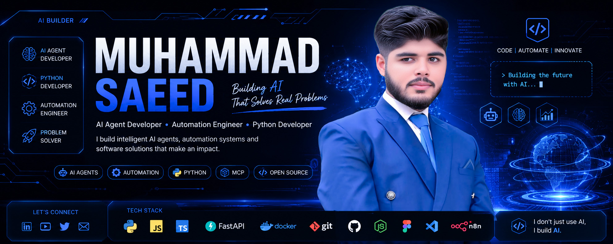

<!-- ========================= -->
<!--        HEADER BANNER      -->
<!-- ========================= -->

  

<h1 align="center">Hi 👋 I'm Muhammad Saeed</h1>

<h3 align="center">
AI Builder • Multi-Agent Systems Engineer • Automation Architect
</h3>

Building Intelligent AI Systems That Solve Real-World Problems.

---

# 🚀 About Me

I'm passionate about building intelligent AI systems that automate workflows, solve business problems, and improve productivity.

My mission is to build practical AI—not just chatbots, but intelligent software that can reason, automate, and make an impact.

Currently I'm focused on building my own AI ecosystem called **VerityAgent** while developing an advanced personal AI assistant inspired by JARVIS.

---

# 🎯 Current Focus

- 🤖 Building VerityAgent
- 🧠 Developing my own JARVIS AI Assistant
- ⚡ AI Agents & Multi-Agent Systems
- 🐍 Python Development
- 🔗 MCP (Model Context Protocol)
- 🌐 AI Automation
- 🔥 Open Source Development

---

# 💭 Philosophy

"I don't chase AI trends.

I build intelligent systems that automate real work, solve business problems, and create measurable impact."
---

# 🛠 Tech Stack

## Languages

---

## AI & LLM

<h3 align="center">AI & Automation</h3>

---

## Backend

- FastAPI
- Flask
- REST APIs

---

## Automation

- n8n
- Playwright
- Web Automation
- Desktop Automation

---

## Tools

---

# 🚀 Featured Projects

## 🤖 VerityAgent

An intelligent AI agent platform focused on business automation, productivity, and custom AI solutions.

---

## 🧠 JARVIS AI

A self-hosted AI assistant capable of:

- Computer Control
- Voice Commands
- Coding Assistance
- Web Browsing
- Automation
- Multi-Agent Workflows

---

## ⚡ AI Automation Workflows

A collection of automation projects built using Python, APIs, and AI models.

---

## 🔌 MCP Examples

Learning and experimenting with the Model Context Protocol.

---

## 🐍 Python Utilities

Useful Python scripts and developer tools.

---
# 📈 GitHub Stats

<h2 align="center">📊 GitHub Stats</h2>

  
  

<h2 align="center">🏆 GitHub Trophies</h2>

---

# 🔥 GitHub Streak

<h2 align="center">🔥 GitHub Streak</h2>

---

# 🏆 Goals for 2026

- ✅ Build JARVIS
- ✅ Launch VerityAgent
- ⬜ Release Open Source AI Projects
- ⬜ Build AI SaaS Products
- ⬜ Contribute to Open Source
- ⬜ Publish AI Tutorials
- ⬜ Help Businesses Automate with AI

# 💼 Open To

- 🤖 AI Agent Development
- ⚡ AI Automation Projects
- 🧠 Multi-Agent Systems
- 🌐 API Integrations
- 🏢 Business Automation
- 🚀 Startup Collaboration
- 💼 Freelance Projects

---

# 🌎 Connect With Me

<h2 align="center">🌐 Connect With Me</h2>

---

# ⚡ Fun Fact

I started my career as a designer.

Today I'm building AI systems that automate real work and solve practical problems.

---

<h3 align="center">

🚀 Building Autonomous AI Systems That Solve Real Business Problems

</h3>

<i>Code • Automate • Innovate</i>

